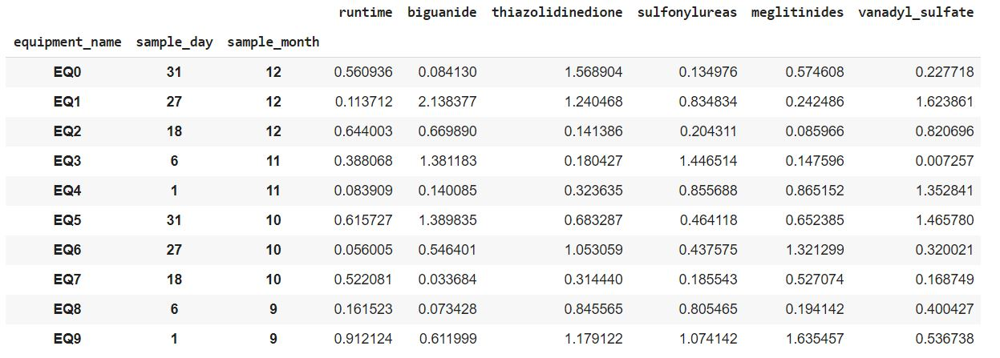
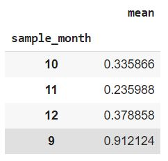

Welcome to the CMC Data Engineering Tech Exercise. We hope you'll enjoy completing it just as much as we've enjoyed doing it for you. Please bare in mind what's most important for us is understanding how you go about problem solving.

Giving just the precise answer or just the adequate code is sufficient, but you can also write an explanation of your solution or strategy, including diagrams, prints, or whatever you see fit. We'll be going through the results monday the 17-05-2021, meaning we'll only take into account the last push to main of your own github repo, dating before 00:00 of 16-05-2021. Your repo should be a clone of this one.

Optionally, you can simply send us your solutions by email. Either way, you'll get a chance to add/comment on your solution on the next interview.


Wishing you the best of lucks,
Grateful for your time so far,

**The NN CMC Data Foundation Team**


Should you have any questions, please contact Diogo at 31443612, the 14-05-2012 from 09:00 to 16:00.

## exercise 1 DevOps
### exercise 1.1 SSH Clone

A team of chemists needs you to securely clone this repo with an SSH key. Show that you've successfuly cloned and pushed to your cloned public repo by sending us its url. 

*Solution 1.1*
For this an SSH Key pair was needed which was generated locally. Then, `git clone` was used to securely clone the repo using the key generated. 


### exercise 1.2 Git Ops

The branching policy requires that you branch ``main`` to `dev`, and `dev` to feature branches `exercise21`, `exercise22` and `readme` (see image below).

```
main
│
╰─ dev
    │
    ├─ readme
    ├─ exercise21
    ╰─ exercise22
```

Develop the solution to exercise **2.1** in the ``exercise21`` branch. Commit , push and merge with `dev`. Branch to `exercise22`, develop the solution to exercise **2.2** and repeat the proccess. Don't forget not to delete the branches, we'll be looking at them.

When merging from `exercise22` to `dev`, force some sort of conflict. Explain how you fixed it in the commit message. 

All your edits to this file should me made on the `readme` branch.

After you have finished your exercises, merge to `dev` and then to `main`. We'll be checking the last push before 01:10, 16-05-2021.

*Solution 1.2*
The branches were created as required.
A conflict was created for Excercise22, by first updating the solution for Excercice22. Then another branch with thee name conflicting_branch was created and here a local variable called avg_monthly_runtime was modified. Since this had a different value in the original solution for 2.2, changing this value created a conflict *while trying to merge this branch and Excercise22 branch to dev*. The conflict was resolved by choosing the value from Excercise22 (originally set to None). 

## exercise 1.3: Packages

Deploy a python package named `cmc_dataeng_internship_<your-name>` to PyPi. We'll be running `pip install cmc_dataeng_internship_<your-name>` and executing the python package such that:

```python
>>> from cmc_dataeng_internship_<your-name> import exercise13
>>> exercise13.moto()
Coding for our patients.
```

*Solution: `pip install cmc_dataeng_internship_avneetkaur`*


## exercise 2 Data Analytics
 You'll find a simple pandas exercise in `data_analytics.py`. The code you find is to be left untouched. You should replace only the lines where you read `# your solution here`. As a hint, your `equipment_measures` dataset could look something like this:

 
 
 to which the runtime averages would be:
 
 

 *Solution 2.1*
```python
	equipment_measurements = pd.concat([equipments,measurements],axis=1)
	equipment_measurements['equipment_name'] = [('EQ'+ str(i)) for i in range(0,10)]
	equipment_measurements = (equipment_measurements.set_index(['equipment_name',"sample_day","sample_month"]))
```
 

 *Solution 2.2*
```python
 	equipment_measurements_filtered = equipment_measurements[(equipment_measurements['biguanide']>meglitinides_measurement) & equipment_measurements['sulfonylureas']>meglitinides_measurement]
	equipment_measurements_filtered.groupby('sample_month').agg(['mean'])['runtime']
```
  
